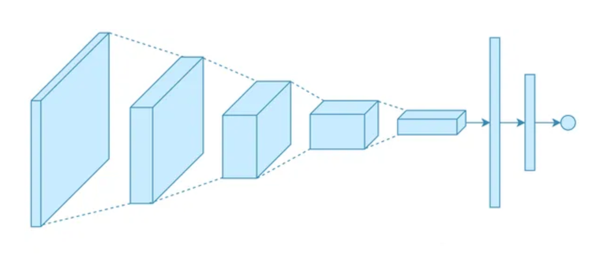

# Intro to Deep Learning

A repository for the programming assignments in the "Intro to Deep Learning" course.

The assignments included the following subjects:

[Linear Regression](linear_regression) | [Fully-Connected Neural Network](nn) | [Convolutional Neural Network](cnn)
:---: | :---: | :---:
 |  | 